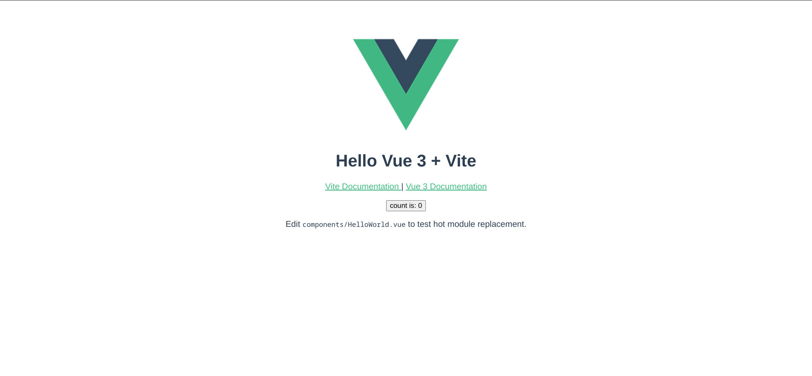

# Vue 3 + Vite

This template should help get you started developing with Vue 3 in Vite. The template uses Vue 3 `<script setup>` SFCs, check out the [script setup docs](https://v3.vuejs.org/api/sfc-script-setup.html#sfc-script-setup) to learn more.

While this project uses Vue.js, Vite supports many popular JS frameworks. [See all the supported frameworks](https://vitejs.dev/guide/#scaffolding-your-first-vite-project).

## Deploy Your Own

Deploy your own Vite project with Vercel.

[](https://vercel.com/new/clone?repository-url=https://github.com/vercel/vercel/tree/main/examples/vite&template=vite)

_Live Example: https://vite-vue-template.vercel.app_

### Deploying From Your Terminal

You can deploy your new Vite project with a single command from your terminal using [Vercel CLI](https://vercel.com/download):

```shell
$ vercel
```

## Screenshots




## Languages and Tools 🗣️🔧

1. **Languages** 🗣️
    + [HTML](https://github.com/topics/html)
    + [HTML5](https://github.com/topics/html5)
    + [CSS](https://github.com/topics/css)
    + [CSS3](https://github.com/topics/css3)
    + [JavaScript](https://github.com/topics/javascript)
    + [Vue.js](https://github.com/topics/vue)
    + [Vue3](https://github.com/topics/vue3)
    + [Vite](https://github.com/topics/vite)

2. **Tools** 🔧
    + [Chrome](https://github.com/topics/chrome)
    + [Figma](https://github.com/topics/figma)
    + [VSCode](https://github.com/topics/vscode)
    + [Netlify](https://github.com/topics/netlify)
    + [Vercel-App](https://github.com/topics/vercel)

                
## Author 
**Mastoora Turkmen**  
[LinkedIn](https://www.linkedin.com/in/mastoora-turkmen/) 
